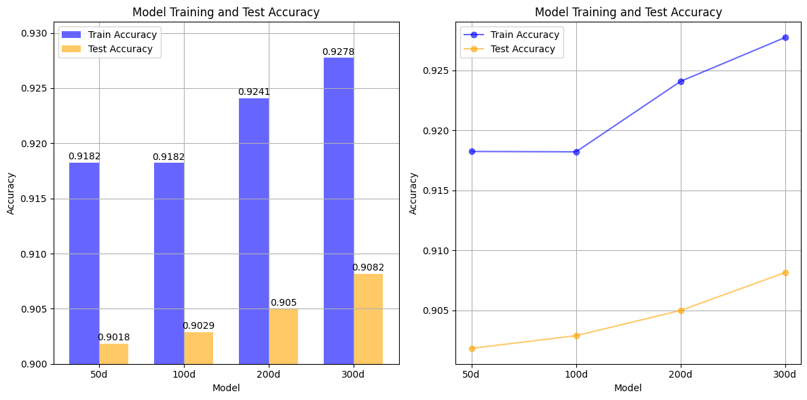

# Uso de embeddings preentrenados.

<div alugn="justify">
  
## 1. Introducción

En el ámbito del procesamiento de lenguaje natural (PLN), el modelo LSTM (*Long Short-Term Memory*) representó un avance significativo, superando los resultados obtenidos hasta su introducción. Este modelo permitió abordar tareas complejas en PLN que previamente se consideraban inalcanzables debido a su capacidad para capturar dependencias a largo plazo en secuencias de datos.

Por otro lado, el desarrollo de *GloVe* (*Global Vectors for Word Representation*) hizo posible generar representaciones vectoriales (o *embeddings*) de palabras en un espacio de dimensiones reducidas, reflejando las relaciones semánticas entre ellas. Estas representaciones han sido fundamentales para mejorar el rendimiento y la precisión en múltiples aplicaciones de PLN.

Este repositorio contiene una implementación de una red LSTM que utiliza como vectores de entrada los *embeddings* generados a partir de las matrices de GloVe, disponibles a través de la biblioteca `torchtext` de `PyTorch`.

## 2. Dataset

El dataset "AG_NEWS" es un conjunto de datos ampliamente empleado en el ámbito del procesamiento del lenguaje natural (NLP) para tareas de clasificación de texto. Está compuesto por noticias de diversas categorías y se usa con frecuencia para clasificar textos. Este dataset incluye cuatro categorías principales de noticias:

1. **World**: Noticias sobre eventos globales, como política internacional, relaciones entre países y sucesos mundiales en general.
2. **Sports**: Información relacionada con deportes, como eventos, resultados de partidos y competiciones tanto nacionales como internacionales.
3. **Business**: Noticias del ámbito empresarial, financiero y económico, que abarcan temas como empresas, economía, informes de ganancias, entre otros.
4. **Sci/Tech**: Noticias vinculadas a la ciencia y tecnología, incluyendo avances científicos, innovaciones tecnológicas, gadgets y descubrimientos.

Cada registro en AG_NEWS típicamente incluye un título y el contenido de la noticia, junto con una etiqueta que indica la categoría correspondiente.

## 3. Modelos de *Glove* preentrenados

En `torchtext.vocab.GloVe` se dispone de varios modelos preentrenados de *word embeddings* que permiten representar palabras en vectores numéricos. Algunos de los modelos disponibles son:

- **glove.42B.300d**: Entrenado en un corpus de 42 mil millones de palabras, con vectores de 300 dimensiones.
- **glove.840B.300d**: Entrenado en un corpus más extenso de 840 mil millones de palabras, con vectores de 300 dimensiones.
- **glove.twitter.27B.xxd**: Basado en 27 mil millones de palabras de Twitter, con vectores de 25,50,100 y 200 dimensiones.
- **glove.6B.50d**: Entrenado en un corpus de 6 mil millones de palabras, con vectores de 50, 100, 200 y 300 dimensiones.

Se han seleccionado los modelos **glove.6B** para este caso particular ya que, entre los diferentes disponibles, son los que tienen un menor tamaño en términos de almacenamiento y son más livianos en comparación con los entrenados en corpus más grandes, como los de 42B o 840B. Esto permite un balance adecuado entre rendimiento y consumo de recursos, ideal para tareas que no requieren un modelo de gran escala. A continuación, se cargan las matrices de embeddings para las distintas dimensiones del modelo **6B**:

- `glove_6B_50`: Modelo con 50 dimensiones, obteniendo la matriz de embeddings correspondiente (`embedding_matrix_50`).
- `glove_6B_100`: Modelo con 100 dimensiones, obteniendo la matriz (`embedding_matrix_100`).
- `glove_6B_200`: Modelo con 200 dimensiones, y su matriz de embeddings (`embedding_matrix_200`).
- `glove_6B_300`: Modelo con 300 dimensiones, con su correspondiente matriz (`embedding_matrix_300`).

Cada matriz se genera utilizando el vocabulario específico del modelo, asegurando que las representaciones de las palabras estén alineadas con los embeddings preentrenados.

```python
glove_6B_50 = GloVe(name='6B', dim=50)
embedding_matrix_50 = glove_6B_50.get_vecs_by_tokens(vocab.get_itos())

glove_6B_100 = GloVe(name='6B', dim=100)
embedding_matrix_100 = glove_6B_100.get_vecs_by_tokens(vocab.get_itos())

glove_6B_200 = GloVe(name='6B', dim=200)
embedding_matrix_200 = glove_6B_200.get_vecs_by_tokens(vocab.get_itos())

glove_6B_300 = GloVe(name='6B', dim=300)
embedding_matrix_300 = glove_6B_300.get_vecs_by_tokens(vocab.get_itos())
```

## 4. Modelo LSTM introduciendo el uso de los *embeddings* preentrenados

El modelo creado recibe la representación *One-hot* de la palabra, la pasa por la capa de Glove, luego por la LSTM y finalmente clasifica la palabra. La Figura 1 muestra esquemáticamente el modelo implementado.

<div align="center">
  
    <p><strong>Figura 1.</strong> Modelo implementado. </p> 
</div>

## 5. Resultados obtenidos

Con base en los gráficos  (Figura 2), se puede concluir que la precisión del modelo aumenta tanto en el conjunto de entrenamiento como en el de prueba a medida que se incrementa la complejidad del modelo. En el caso del **conjunto de entrenamiento**, la precisión se mantiene constante en los primeros modelos (50d y 100d) con un valor de 0.9182, pero aumenta gradualmente a medida que el modelo se hace más grande, alcanzando una precisión de 0.9278 en el modelo de 300d.

<div align="center">
  
    <p><strong>Figura 2.</strong> Precisión de entrenamiento y test global. </p> 
</div>

Por otro lado, la precisión en el **conjunto de prueba**, aunque es más baja que en el entrenamiento, también mejora conforme el modelo crece. Comienza en 0.9018 para el modelo de 50d, y aunque la mejora es menor, sigue una tendencia ascendente, alcanzando su punto máximo en 0.9082 con el modelo más grande (300d). Esta diferencia sugiere que el modelo está generalizando mejor con tamaños mayores, aunque la ganancia no es tan significativa.

<div align="center">
  
    <p><strong>Figura 3.</strong> Precisión de entrenamiento y test individual. </p> 
</div>

Sin embargo, es importante notar que la diferencia entre la precisión del entrenamiento y la de prueba se amplía a medida que crece el tamaño del modelo, lo que podría indicar un **riesgo de sobreajuste** (overfitting). Esto sugiere que, aunque modelos más complejos logran mejores resultados, los incrementos en la precisión del conjunto de prueba son menores comparados con los del entrenamiento, lo que implica que seguir aumentando la complejidad podría llevar a rendimientos decrecientes.

</div>
